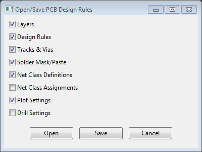
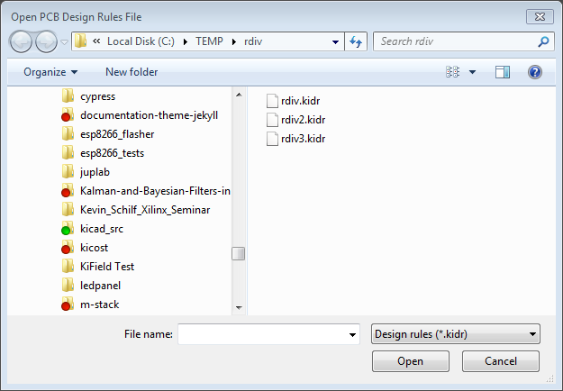
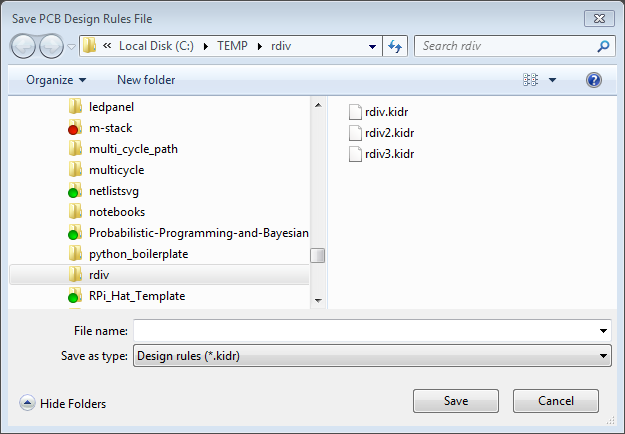

# DRMgr Plugin

This PCBNEW plugin lets you save and restore the board settings for a PCB.
This is useful for storing the design rules of a particular PCB fab and then
applying them to an existing or new project.

* Free software: MIT license

## Features

* Save current PCBNEW board settings into a file.
* Apply board settings from a file into a current PCBNEW session.
* Portions of the board settings that are stored or retrieved is selectable.

## Installation

Just copy `DRMgr.py` file to one of the following directories:

* Windows: `kicad/share/kicad/scripting/plugins`.
* Linux: `kicad/scripting/plugins`.

You will also have to install the [KinJector Python package](https://github.com/xesscorp/kinjector) using these
[instructions](https://xesscorp.github.io/kinjector/docs/_build/singlehtml/index.html).

## Usage

The plugin is started by pressing the `Tools => External Plugins... => DRMgr` button.
This brings up a dialog window with three buttons:

* `Open`: Opens a file containing board settings and applies them to the current board.
* `Save`: Stores the settings for the current board into a file.
* `Cancel`: Oh, just forget it!

There are also checkboxes to enable the portions of the board settings that are
saved or restored:

* `Layers`: List of enabled/visible PCB layers along with number of wiring layers and PCB thickness.
* `Design Rules`: The minimum track/via/microvia dimensions and some miscellaneous flags.
* `Tracks & Vias`: Dimensions for pre-defined tracks and vias.
* `Soldfer Mask/Paste`: Dimensions and clearances for solder mask and paste.
* `Net Class Definitions`: Width/clearance/via/microvia/ dimensions for classes of nets.
* `Net Class Assignments`: Assignments of nets to net classes.
* `Plot Settings`: Parameters and options controlling the output of Gerber or other plotting files.
* `Drill Settings`: Parameters and options controlling the output of drill files (not currently working).

### Applying Design Rules

Pressing the `Open` button brings up the following window:

Selecting a design rule file (having the default suffix of `.kidr`) and then clicking the
`Open` button will apply the settings in the file to the board currently open
in PCBNEW.
The state of the dialog checkboxes will determine which sections of the file
will be applied to the board.
 

### Saving Design Rules

Pressing the `Save` button brings up the following window:

Selecting a design rule file or typing a file name and then clicking the
`Save` button will load the file with all the settings for the board currently open
in PCBNEW.
The state of the dialog checkboxes will determine which portions of the board settings
will be stored in the file.

### Editing Design Rules

The dialog checkboxes will determine which board settings are saved in the
design rule file.
If you do not want to apply some of these settings (e.g., layer visibility flags
or net class assignments), just uncheck the appropriate boxes.

If you want finer control of which settings are saved or restored, you can open the
file and delete those portions of the hierarchy you don't need.

If you want more detailed control of the design rule values, it's usually
easier to open the file in PCBNEW, make changes in the
`File => Board Setup...` dialog, and then save the altered board settings
into the original file or a new file.

### Caveats

Due to deficiencies in the PCBNEW Python API, DRMgr is currently unable to 
store or update design rules for the following board features:

* Text and graphic dimensions for all layers,
* Widths, gaps, and via gaps for pre-defined differential pairs.

## Credits

### Development Lead

* XESS Corp. <info@xess.com>

### Contributors

None yet. Why not be the first?

## History

### 0.1.0 (2019-06-08)

* First release.
